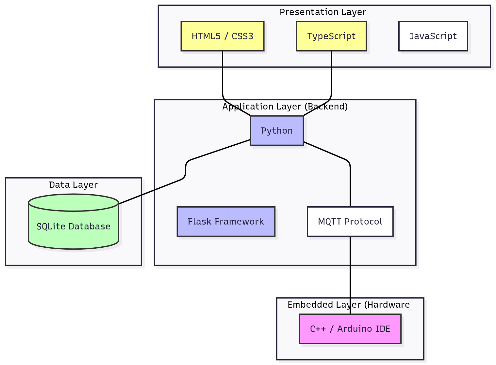

# Telix IoT System

Telix is a system for testing and experimenting with Internet of Things (IoT) applications. The system is characterized by its simple architecture, making it possible for non-experts in this field to try and develop it in any way. The system is primarily based on the MQTT protocol and Mosquitto as a broker, with Python on the backend and TypeScript on the frontend.

## System Architecture


## Dashboard

The platform provides readings and offers graphical visualization of data coming from sensors. It also provides a display of connected devices, remote device control, and offers the feature of automatically sending commands to another device on the network. For example, if the temperature rises, a command will be automatically sent to another device to take a user-selected action. If connected to the internet, it sends notifications via Telegram.



## Project Structure

```
Telix_IoT/
├── api.py                  # Flask REST API server
├── recever.py              # MQTT receiver/service
├── data/
│   ├── database.db        # SQLite database
│   └── src_db.sql         # Database schema
├── Dashborad/             # Frontend React application
│   ├── src/
│   │   ├── pages/         # Page components
│   │   ├── components/    # UI components
│   │   ├── utils/         # API utilities
│   │   └── ...
│   ├── package.json
│   └── vite.config.ts
├── clients_src/           # ESP32 Arduino code examples
│   ├── BH1750.ino
│   ├── BMP280.ino
│   ├── dth22_mqtt.ino
│   ├── recev_esp32.ino
│   └── standred_code.ino
└── pic/                   # Images and diagrams
    ├── system Architecture.png
    └── dashbord.png
```

## Required Tools and Dependencies

### System Requirements

- **Operating System**: Linux (tested on Raspberry Pi OS), macOS, or Windows
- **Python**: Python 3.7 or higher
- **Node.js**: Node.js 18.x or higher (for frontend)
- **MQTT Broker**: Mosquitto MQTT broker

### Backend Dependencies (Python)

The following Python packages are required:

- `flask` - Web framework for the REST API
- `flask-cors` - CORS support for Flask
- `paho-mqtt` - MQTT client library

### Frontend Dependencies (Node.js/TypeScript)

All frontend dependencies are listed in `Dashborad/package.json`. The main technologies include:

- React 18
- TypeScript
- Vite (build tool)
- Tailwind CSS
- shadcn/ui components
- Recharts (for data visualization)

## Installation and Setup

### 1. Install MQTT Broker (Mosquitto)

#### On Linux (Debian/Ubuntu/Raspberry Pi OS):
```bash
sudo apt-get update
sudo apt-get install mosquitto mosquitto-clients
sudo systemctl enable mosquitto
sudo systemctl start mosquitto
```

#### On macOS:
```bash
brew install mosquitto
brew services start mosquitto
```

#### On Windows:
Download and install from: https://mosquitto.org/download/

Verify Mosquitto is running:
```bash
# On Linux/macOS
sudo systemctl status mosquitto

# Or test with
mosquitto_pub -h localhost -t test -m "hello"
```

### 2. Set Up Python Backend

#### Install Python Dependencies

```bash
# Navigate to project root
cd /path/to/Telix_IoT

# Install Python packages (use pip or pip3 depending on your system)
pip install flask flask-cors paho-mqtt

# Or create a requirements.txt and install:
pip install -r requirements.txt
```

#### Initialize Database

The database schema is defined in `data/src_db.sql`. The database file should be located at `data/database.db`.

If the database doesn't exist or you need to recreate it:

```bash
# Navigate to data directory
cd data

# Create database from schema (if using sqlite3 command line)
sqlite3 database.db < src_db.sql

# Or use Python to initialize
python3 -c "import sqlite3; conn = sqlite3.connect('database.db'); open('src_db.sql').read(); conn.executescript(open('src_db.sql').read()); conn.close()"
```

**Note**: Make sure the `data/` directory exists and has write permissions.

#### Configure Database Path

There is a path inconsistency in the codebase:

- `recever.py` uses: `DB_PATH = "data/database.db"` ✅ (correct)
- `api.py` uses: `DB_PATH = 'database.db'` ❌ (needs update)

**Before running**, update `api.py` line 21 to:
```python
DB_PATH = 'data/database.db'  # Update this path
```

#### Configure MQTT Broker IP

In both `api.py` and `recever.py`, update the MQTT broker IP if needed:

- `api.py` line 22: `MQTT_BROKER = "localhost"` (or your broker IP)
- `recever.py` line 8: `BROKER_IP = "localhost"` (or your broker IP)

### 3. Set Up Frontend

#### Install Node.js Dependencies

```bash
# Navigate to Dashborad directory
cd Dashborad

# Install dependencies
npm install

# Or if using yarn
yarn install
```

#### Configure API Base URL

The frontend connects to the backend API. Update the API base URL in `Dashborad/src/utils/api.ts`:

```typescript
// Line 1 - Update with your backend server IP and port
const API_BASE_URL = "http://localhost:5000/api";  // For local development
// Or use your server's IP: "http://192.168.1.100:5000/api"
```

**Note**: The default is set to `http://10.42.0.1:5000/api`. Change this to match your backend server's IP address and port.

## Running the System

### Step-by-Step Startup

#### 1. Start MQTT Broker (Mosquitto)

The broker should already be running as a service. If not:

```bash
# Linux/systemd
sudo systemctl start mosquitto

# macOS
brew services start mosquitto

# Or run directly (for testing)
mosquitto -c /etc/mosquitto/mosquitto.conf
```

#### 2. Start MQTT Receiver Service

In a terminal, run the MQTT receiver that listens for device messages:

```bash
# From project root
cd /path/to/Telix_IoT
python3 recever.py
```

You should see:
```
Connecting to broker...
Connected to MQTT Broker!
Server is running and listening...
```

Keep this terminal open and running.

#### 3. Start Flask API Server

In a **new terminal**, start the REST API server:

```bash
# From project root
cd /path/to/Telix_IoT
python3 api.py
```

You should see:
```
==================================================
🚀 Starting IoT API Server...
📊 Database: data/database.db
📡 MQTT Broker: localhost
🌐 Server: http://0.0.0.0:5000
==================================================
```

The API server runs on port 5000 by default. Keep this terminal open.

#### 4. Start Frontend Development Server

In a **new terminal**, start the frontend:

```bash
# Navigate to Dashborad directory
cd Dashborad
npm run dev
```

You should see output like:
```
  VITE v5.x.x  ready in xxx ms

  ➜  Local:   http://localhost:8080/
  ➜  Network: http://192.168.1.100:8080/
```

The frontend runs on port 8080 by default (configured in `vite.config.ts`).

### Accessing the Dashboard

Open your web browser and navigate to:

```
http://localhost:8080
```

Or from another device on your network:

```
http://<your-server-ip>:8080
```

For example, if running on Raspberry Pi with IP 192.168.1.100:
```
http://192.168.1.100:8080
```

## Complete Startup Script

You can create a startup script to run all services at once. Create a file `start.sh`:

```bash
#!/bin/bash

# Start MQTT Receiver in background
echo "Starting MQTT Receiver..."
python3 recever.py &
RECEIVER_PID=$!

# Wait a moment for receiver to initialize
sleep 2

# Start Flask API in background
echo "Starting Flask API..."
python3 api.py &
API_PID=$!

# Wait a moment for API to initialize
sleep 2

# Start Frontend
echo "Starting Frontend..."
cd Dashborad
npm run dev &
FRONTEND_PID=$!

echo "All services started!"
echo "MQTT Receiver PID: $RECEIVER_PID"
echo "Flask API PID: $API_PID"
echo "Frontend PID: $FRONTEND_PID"
echo ""
echo "Dashboard available at: http://localhost:8080"
echo ""
echo "Press Ctrl+C to stop all services"

# Wait for interrupt
wait
```

Make it executable and run:
```bash
chmod +x start.sh
./start.sh
```

## Testing the System

### Test MQTT Connection

```bash
# Subscribe to test topic
mosquitto_sub -h localhost -t "test"

# In another terminal, publish a message
mosquitto_pub -h localhost -t "test" -m "Hello MQTT"
```

### Test API Endpoints

```bash
# Health check
curl http://localhost:5000/api/health

# Get all devices
curl http://localhost:5000/api/devices

# Get device details
curl http://localhost:5000/api/devices/<device_id>
```

### Test Device Registration

Devices should publish registration messages to the `config` topic with JSON format:

```json
{
  "device_id": "esp32-001",
  "device_name": "ESP32 Sensor",
  "ssid": "YourWiFi",
  "ip": "192.168.1.50",
  "pub_topic": "data/esp32-001",
  "sub_topic": "devices/esp32-001/command",
  "data_types": ["temperature", "humidity"],
  "commands": ["on", "off"],
  "recev_comands": "yes",
  "type_of_commands": ["switch"]
}
```

## Configuration

### Backend Configuration

- **Database Path**: Ensure both `api.py` and `recever.py` use the correct path (`data/database.db`)
- **MQTT Broker**: Update `BROKER_IP` and `MQTT_BROKER` if your broker is on a different host
- **API Port**: Flask API runs on port 5000 by default (can be changed in `api.py`)

### Frontend Configuration

- **API Base URL**: Update `Dashborad/src/utils/api.ts` with your backend server IP
- **Port**: Frontend runs on port 8080 (configured in `Dashborad/vite.config.ts`)

## Device Integration

ESP32 example code is provided in the `clients_src/` directory:

- `BH1750.ino` - Light sensor example
- `BMP280.ino` - Pressure sensor example
- `dth22_mqtt.ino` - Temperature and humidity sensor (DHT22)
- `recev_esp32.ino` - Command receiving example
- `standred_code.ino` - Standard template

Upload the appropriate code to your ESP32 device and configure it with:
- WiFi credentials (SSID and password)
- MQTT broker IP address
- Device ID and name

## Troubleshooting

### Database Connection Errors

- Ensure `data/database.db` exists
- Check file permissions: `chmod 644 data/database.db`
- Verify the database path in both `api.py` and `recever.py`

### MQTT Connection Issues

- Verify Mosquitto is running: `sudo systemctl status mosquitto`
- Check broker IP address matches in both Python files
- Test MQTT manually with `mosquitto_pub` and `mosquitto_sub`

### API Connection Errors (Frontend)

- Verify Flask API is running on port 5000
- Check `API_BASE_URL` in `Dashborad/src/utils/api.ts`
- Check CORS is enabled in `api.py`
- Verify firewall allows connections on port 5000

### Frontend Build Errors

- Ensure Node.js version is 18.x or higher: `node --version`
- Delete `node_modules` and reinstall: `rm -rf node_modules && npm install`
- Check for port conflicts (8080 already in use)

## Production Deployment

### Backend (Production)

For production, use a WSGI server like Gunicorn:

```bash
pip install gunicorn
gunicorn -w 4 -b 0.0.0.0:5000 api:app
```

### Frontend (Production)

Build the frontend for production:

```bash
cd Dashborad
npm run build
```

The built files will be in `Dashborad/dist/`. Serve them with a web server like Nginx.

### Systemd Services (Linux)

Create systemd service files to run the backend services automatically on boot.

## License

[Specify your license here]

## Contributing

[Contribution guidelines if applicable]

## Support

For issues and questions, please open an issue on the project repository.

